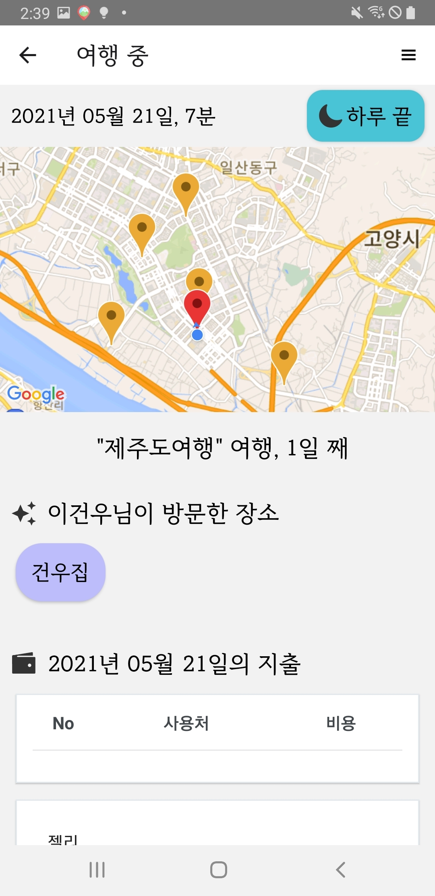
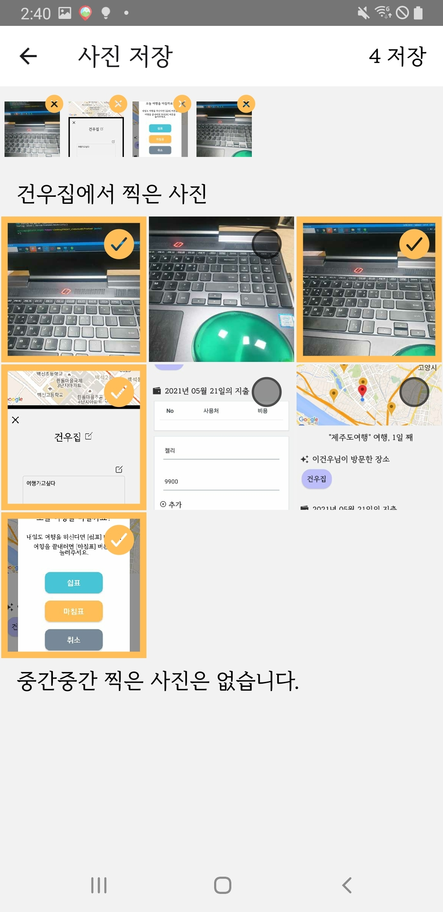
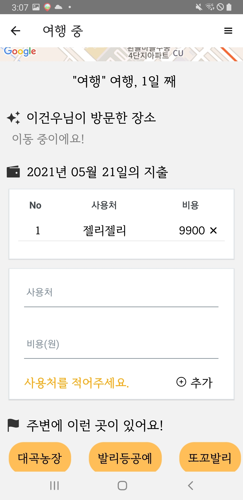
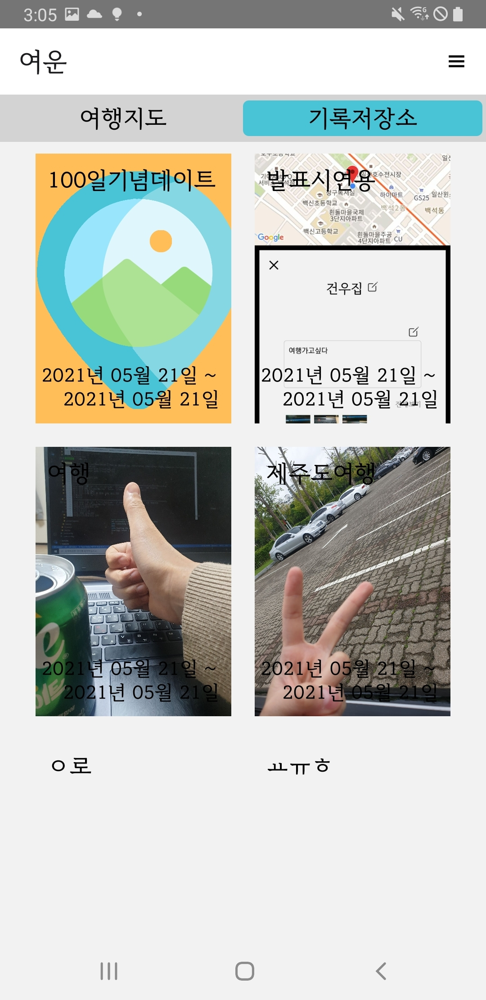

# 여운(AfterGlow)

<div align=center>
    
    
    
    
    
    
    
</div>


여운은  사용자가 여행을 하는 동안 사용자의 위치를 받아와 방문지를 자동으로 저장하고, 방문지에 따라 사진을 분류해 여행 기록을 저장해주는 모바일 앱 서비스입니다.

여행 경로, 찍은 사진, 메모, 가계부 등 자동으로 여행 정보를 기록합니다.


* 수행 기간:  2021.04.11 ~ 2021.05.21

- UCC : https://youtu.be/eXq92L7ck0s

- 시연 영상 : https://youtu.be/dsKoFuJl8U0


## 목차

### [팀원소개](#팀원소개) 

### [기술스택](#기술스택)

### [구동방법](#구동방법)

### [기능소개](#기능소개)


## 팀원소개

> 수행 인원 : 5명

* 고영길 - Backend

* 김동준 - Backend
* 김동현 - Frontend

* 김민정 - Frontend

* 이건우 - Frontend


## 기술스택

### Backend 구성 요소

| 기술 스택 |   Version   | Comment                             |
| :-------: | :---------: | :---------------------------------- |
|   Java    |     11      |                                     |
|  Spring   |   2.3.10    | Rest API 웹 애플리케이션 개발       |
|  MariaDB  |   10.5.9    | DB                                  |
|  Ubuntu   | 20.04.2 LTS | 서비스 제공을 위해 리눅스 서버 구축 |
|  Docker   |   20.10.2   | 컨테이너화 된 애플리케이션 관리     |
|   Nginx   |             | 웹 서버 구동                        |

### Frontend 구성 요소

|   Frontend   | Version | Comment                       |
| :----------: | :-----: | :---------------------------- |
|     Vue      | 2.6.11  | 랜딩 페이지 (설치 경로 연결 ) |
| React-Native | 0.64.0  | 앱 제작                       |


|                   React 라이브러리                    | Version | Comment                                                  |
| :---------------------------------------------------: | :-----: | :------------------------------------------------------- |
|                         axios                         | 0.21.1  | REST API 요청                                            |
|              react-native-async-storage               | 1.15.4  | 로컬저장소 사용                                          |
|           react-native-community/cameraroll           |  4.0.4  | 갤러리에서 사진 불러오기                                 |
|          react-native-community/geolocation           |  2.0.2  | 현재 내 위치 정보                                        |
|             react-native-cookies/cookies              |  6.0.7  | 토큰을 쿠키게 저장하기 위해 사용                         |
|            react-native-seoul/kakao-login             |  3.3.2  | 카카오 로그인 구형                                       |
|                   react-navigation                    | 5.12.5  | stack, drawer 등 화면이동을 위해 사용                    |
| @voximplant/react-native-foreground-service": "^2.0.0 |  2.0.0  | 앱이 실행중이 아닐 때 위치 추적을 위해 사용              |
|           react-native-geolocation-service            |  5.3.0  | 앱이 살행중일 때 위치 추적                               |
|              react-native-image-resizer               |  1.4.4  | 1mb가 넘어가는 사진의 해상도를 낮추어 저장하기 위해 사용 |
|                   react-native-maps                   | 0.28.0  | google map을 표시하기 위해 사용                          |
|                         redux                         |  4.1.0  | data를 중앙 관리 하기 위해 사용                          |
|                     redux-persist                     |  6.0.0  | 중앙 관리 하는 data를 유지시키기 위해 사용               |
|                      redux-saga                       |  1.1.3  | 비동기로 data를 중앙 관리 하기 위해 사용                 |

## 구동방법


### Server

```bash
# /backend
gradle build
java -jar build/libs/backend-0.0.1-SNAPSHOT.war
```

```bash
# /backend/src/main/resources/application.yml
kakao_rest_api_key: <kakao_rest_api_key>
kakao_secret: <kakao_secret_key>(optional)
server:
    port: 8080
    servlet:
        context-path: /
spring:
    datasource:
        driver-class-name: com.mysql.cj.jdbc.Driver
        password: <DB password>
        url: <DB url>
        username: <DB username>
    jpa:
        hibernate:
            ddl-auto: update
        properties:
            hibername:
                dialect: org.hibernate.dialect.MariaDBDialect
            hibernate:
                default_batch_fetch_size: 1000
                format_sql: true
                use_sql_comments: true
    servlet:
        multipart:
            max-file-size: 10MB
            max-request-size: 10MB

```


### Client

```bash
# /frontend (react)

$ yarn install

$ react-native run-android

# /frontendweb (vue)

$ yarn install

$ yarn serve
```


> https://drive.google.com/drive/folders/1JTCLCmO1HKf2BdCB_JUJJBj9oPEIyJ3j
>
> 모바일 설치, apk 파일 다운로드


## 기능소개

### 1. 여행 경로 기록

> 사용자 위치를 1분 단위로 기록합니다. 

- 분당 이동거리가 100m이하(도보 혹은 그 이상의 이동수단으로 꾸준히 이동하지 않는 경우)일 시 "머무름"상태가 되고 10분 이상 지속 되면 한 장소(관광지)에서 관광하고 있다고 판단하여 핀을 생성합니다. 
- 핀에는 빅데이터에서 가져온 350m내 관광지 or 직접 작성한 이름과 메모를 포함합니다.
- 핀 주변에서 찍은 사진은 핀에 종속되며 장소별 사진 분류에 이용 됩니다.




### 2. 가계부 기록

> 사용자가 직접 소비 내역, 출처를 기록합니다.


### 3. 사진 저장

> 하루가 끝난 시점에 사진들을 장소로 분류하여 보고 선택한 사진만 데이터베이스에 저장합니다. 




### 4. 여행지 추천

> 가까운 위치의 여행지를 추천해줍니다. 




### 5. 슬라이드쇼 생성

> DB에서 사진을 가져와 자동으로 슬라이드쇼를 생성합니다.


      